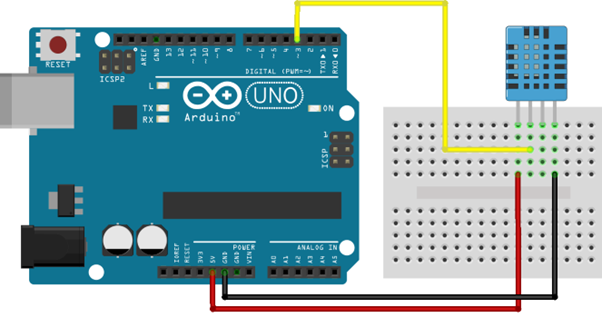
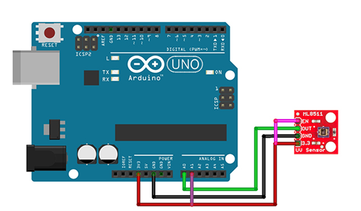
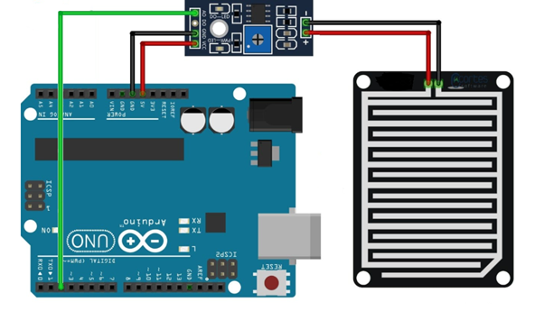
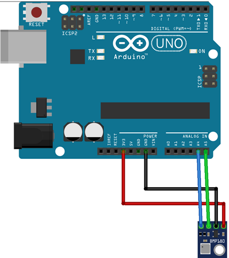

# SensoresClimatologicos
Estación meteorológica simple usando Arduino.   

<h4>Características y componentes principales</h4>
<h5>Sensor DHT22</h5>

Uno de los sensores a utilizar es el DHT22, el cual es un sensor digital de temperatura y humedad relativa de buen rendimiento y bajo costo. 
    Integra un sensor capacitivo de humedad y un termistor para medir el aire circundante, y muestra los datos mediante una señal digital en el pin de datos 
    (no posee salida analógica). Utilizado en aplicaciones de control automático de temperatura, aire acondicionado, monitoreo ambiental en agricultura y más. 
4

<h5>Sensor ML8511. </h5>

Es un sensor de luz ultravioleta (UV), entrega una señal analógica que depende de la cantidad de luz UV que detecta. Es usado en proyectos de monitoreo de condiciones ambientales como el índice UV.
    El sensor ML8511 detecta luz con una longitud de onda entre 280-390nm, este rango cubre tanto al espectro UV-B como al UV-A. La salida analógica está relacionada linealmente con la intensidad UV (mW/cm2). Esta señal analógica puede ser conectada a un microcontrolador para ser convertido por un ADC y así trabajar con la medición.
    

    
    <h5>Sensor FC-37. </h5>

Este sensor te permite saber si está lloviendo o nevando. El sensor posee 2 electrodos separados por una distancia muy pequeña, cuando llueve las gotas de agua cierran el circuito entre los 2 electrodos y permiten el paso de una pequeña corriente. Este cambio de voltaje es detectado por un Amplificador Operacional en modo comparador.
    La tarjeta de acondicionamiento nos entrega una salida digital y una analógica. La salida digital se encarga de mostrar 5 Volts si no hay lluvia y 0 Volts cuando si hay lluvia o nieve. La salida analógica nos entrega un voltaje desde 0 V cuando la lluvia es muy intensa hasta 5V cuando el clima es despejado.
    

    
    <h5>Sensor BMP180</h5>

El sensor BMP180 es un sensor de presión atmosférica de alta precisión. Se comunica mediante un puerto I2C y es digital. También este dispositivo está diseñado para ser conectado directamente a un microcontrolador 
    de un dispositivo móvil a través de I2C. Los datos de presión y temperatura tienen que ser compensados por los datos de calibración del E2PROM del BMP180

    
